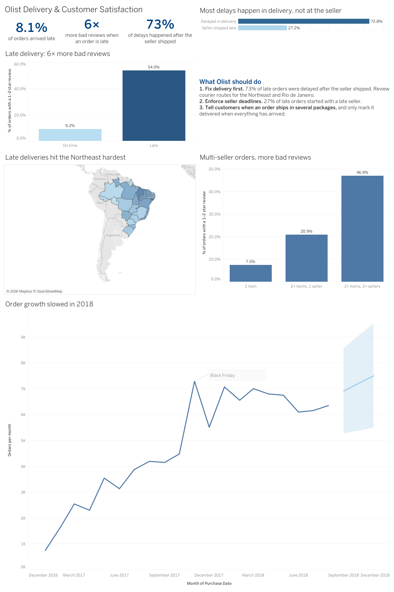

# Olist: What Late and Incomplete Deliveries Cost in Customer Satisfaction

**Interactive dashboard:** [View on Tableau Public](https://public.tableau.com/app/profile/vanessa.ani/viz/OlistDeliveryCustomerSatisfaction/OlistDashboard)



## The question

Olist is a Brazilian marketplace that connects small sellers with customers, with delivery handled by logistics partners. I wanted to find out **which delivery problems hurt customer satisfaction the most, where they happen, and what the company could do about them.**

## Data and tools

- **Data:** [Brazilian E-Commerce Public Dataset by Olist](https://www.kaggle.com/datasets/olistbr/brazilian-ecommerce) (Kaggle), about 99,000 orders from 2016 to 2018. I used four tables: orders, order items, customers and reviews.
- **SQL:** Google BigQuery (joins, CASE, CTEs, window functions, basic text analysis)
- **Visualisation:** Tableau Public (bar charts, map, forecast)

## Approach

1. Checked order statuses and limited the analysis to the **96,478 delivered orders** (about 97% of all orders).
2. Defined an order as **late** when it arrived after the delivery date promised to the customer, and a **bad review** as 1 or 2 stars.
3. Compared review scores for late and on-time orders.
4. Read the words customers used in bad reviews (in Portuguese) to understand *why* they were unhappy.
5. Tested what I found in the comments with numbers: order size and number of sellers.
6. Looked at where late orders happen (by state) and at which stage (seller or delivery).
7. Checked whether a late first order affects repeat purchases.
8. Built one clean table (one row per order) for the Tableau dashboard, including a 3-month forecast of order volume.

## Key findings

**1. Late delivery is the biggest driver of bad reviews.**
8.1% of delivered orders (about 7,800) arrived late. Late orders averaged **2.57 stars**, compared with **4.29** for on-time orders. **54%** of late orders got a 1–2 star review, compared with **9.2%** of on-time orders, so late orders were about 6 times more likely to get a bad review.

**2. Late and on-time customers complain about different things.**
In bad reviews of late orders, the most common words were about waiting: *ainda* (still), *prazo* (deadline), *entrega* (delivery), *dias* (days), as in *"ainda não recebi"* ("I still haven't received it"). In bad reviews of on-time orders, the words pointed to missing or wrong items: *veio* (came), *apenas* (only), *dois* (two), *outro* (another), as in *"comprei dois, veio apenas um"* ("I bought two, only one came"). Reading a sample of these comments confirmed it: most were about receiving fewer items than ordered.

**3. Orders from several sellers get bad reviews almost half the time, even when on time.**

| On-time orders | Orders | Avg. score | Bad reviews |
|---|---|---|---|
| 1 item | 79,662 | 4.36 | 7.5% |
| 2+ items, 1 seller | 7,733 | 3.85 | 21.0% |
| 2+ items, 2+ sellers | 1,258 | 2.87 | 47.0% |

Items from different sellers travel as separate packages, so customers often receive part of the order and think the rest is missing. In one comment, the website already showed the order as "delivered" while items were still missing.

**4. Late deliveries are concentrated in the Northeast, but São Paulo and Rio have the most late orders.**
The highest late rates were all in the Northeast: Alagoas 23.9%, Maranhão 19.7%, Piauí 16.0%, Ceará 15.3%, Sergipe 15.2%, Bahia 14.0%. By volume, São Paulo (5.9% late, 2,387 orders) and Rio de Janeiro (13.5% late, 1,664 orders) together account for roughly half of all late orders. Rio stands out because it has both a high rate and high volume.

**5. Most delays happen in delivery, not at the seller.**
In **72.8%** of late orders, the seller handed the package to the courier before its deadline, so the delay happened in the delivery stage. In 27.2%, the seller shipped late.

**6. A late first order slightly reduces repeat purchases.**
Customers whose first order was on time came back 3.04% of the time, compared with 2.51% after a late first order (about 17% less likely). Repeat buying is rare overall, so the main cost of late delivery shows up in satisfaction rather than repeat sales.

**7. Order growth slowed in 2018.**
Monthly orders grew strongly through 2017, with a Black Friday peak in November 2017, then levelled off at around 6,000–7,000 a month in 2018. Tableau's forecast continues a slight upward trend, which may be optimistic given the slowdown.

## Recommendations

1. **Fix delivery first.** Most late orders were delayed after the seller shipped. Review courier partners and routes for the Northeast and Rio de Janeiro, or set more realistic delivery promises for those regions.
2. **Enforce seller shipping deadlines.** About 1 in 4 late orders started with a seller missing its deadline.
3. **Handle multi-seller orders differently.** Tell customers upfront when an order ships in several packages, give each package its own tracking, and only mark the order as delivered when everything has arrived.

## Limitations

- The data doesn't say which courier delivered each order, so delivery-stage delays can't be traced to a specific company.
- "Seller shipped late" doesn't rule out a slow courier as well, so that group may include both causes.
- The comment sample was found with a keyword search ("apenas"), so it proves the missing-items problem exists but not how big it is. The order-size numbers are the stronger evidence.
- The numbers show links between delivery problems and reviews, not proof of cause.
- A few orders have more than one review. SQL queries count each review; the dashboard table averages them per order, so dashboard numbers can differ slightly (for example 46.9% instead of 47.0%).
- The first months (2016) and the last months of the data are incomplete, so they were left out of the forecast.

## Repository structure

```
   01–13_*.sql    SQL queries, numbered in the order I ran them
   Dashboard.png  dashboard screenshot
```
